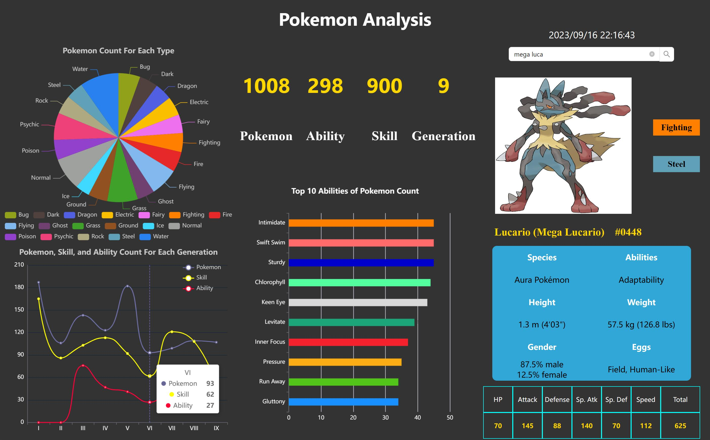

# Demo-Pokemon-Analysis (Flask + React)

[]()[]()

This project is a frontend and backend separation project. 



## How to Use

### Development

#### Prerequisite

- [Python >= 3.8.10](https://www.python.org/downloads)
- [Node.js >= 16.20.1](https://nodejs.org/en/download)

```
# For the backend
$ cd api
$ pip install -r requirements.txt
$ flask run
```

```
# For the frontend
$ cd client
$ npm install
$ npm start
```

### Deployment

#### Docker

```
$ docker-compose up --build
```

